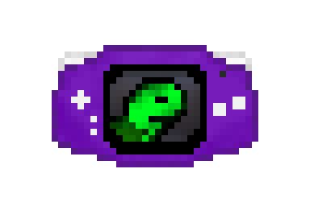

# Welcome to Optime GBA!

<div align="center">

</div>

Optime GBA is a work-in-progress Game Boy Advance and Nintendo DS emulator.

## Current Progress
 - Passing all of [ARMWrestler](https://github.com/destoer/armwrestler-gba-fixed), a simple test of the GBA's CPU
 - Passing all of [jsmolka's gba-suite](https://github.com/jsmolka/gba-suite) CPU instruction tests
### GBA
 - Timers and DMA are implemented
 - Audio is fully implemented and sounds great on all games
 - Near complete emulation of the Pixel Processing Unit (PPU)
 - Save files work for games using flash memory

### Nintendo DS
 - Cold boot through firmware works
 - Booting many popular games, including New Super Mario Bros. and Pokémon Platinum

## Future Plans
 - Further optimization
 - Seek out any unimplemented ARM7TDMI quirks that may remain

### GBA
 - Implement remaining PPU features, fix PPU bugs
    - Sprite mosaic
### Nintendo DS
 - Flash and EEPROM save memory
 - Nintendo DS extended 2D graphical features
 - 3D graphics
 - Dynamic recompiler, possibly in the far future


## Controls
 - **A** - X
 - **B** - Z
 - **X** - S
 - **Y** - A
 - **Start** - Enter
 - **Select** - Backspace
 - **Left** - Left
 - **Right** - Right
 - **Up** - Up
 - **Down** - Down

### Accessory Controls
 - **Turbo** - Tab, Space
 - **Toggle Color Correction** - F1
 - **Toggle Sound FIFO A** - F3
 - **Toggle Sound FIFO B** - F4
 - **Toggle Sound PSG 1** - F5
 - **Toggle Sound PSG 2** - F6
 - **Toggle Sound PSG 3** - F7
 - **Toggle Sound PSG 4** - F8
 - **Fullscreen** - ALT + Enter, F11


## Screenshots


## Running

For building and using Optime GBA, .NET 5 is recommended. You also need a CPU with AVX2 support because I completely overdid the renderer.

A compatible Game Boy Advance BIOS image is required to run the emulator. Place the BIOS in the emulator working directory (the root of the repository when using `dotnet run`) named as `gba_bios.bin`. 

For running Nintendo DS games, official Nintendo DS firmware, ARM9 BIOS, and ARM7 BIOS dumps are required. Place the dumps named as `firmware.bin`, `bios9.bin`, `bios7.bin`, respectively, in the emulator working directory.  

```
# OpenTK Debugger
dotnet run -c Release -p OptimeGBA-OpenTK.csproj
# Simple SDL Frontend 
dotnet run -c Release -p OptimeGBA-SDL.csproj
```
